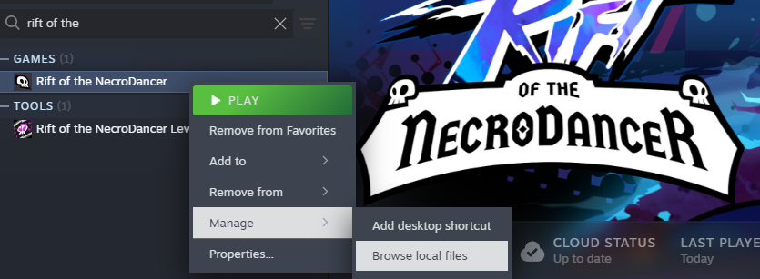
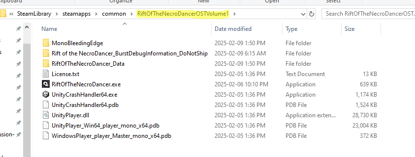
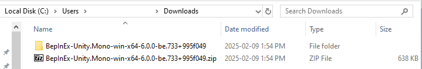
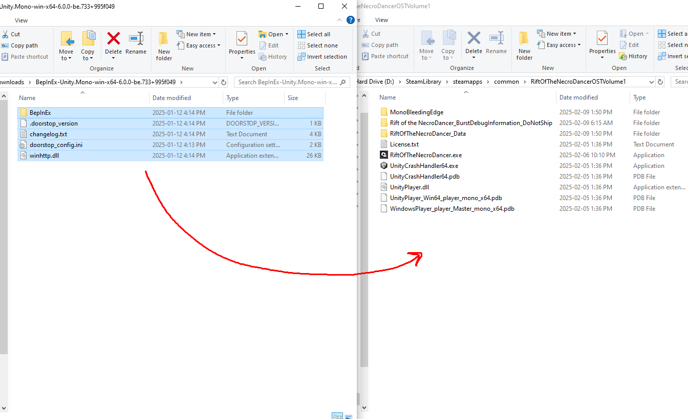
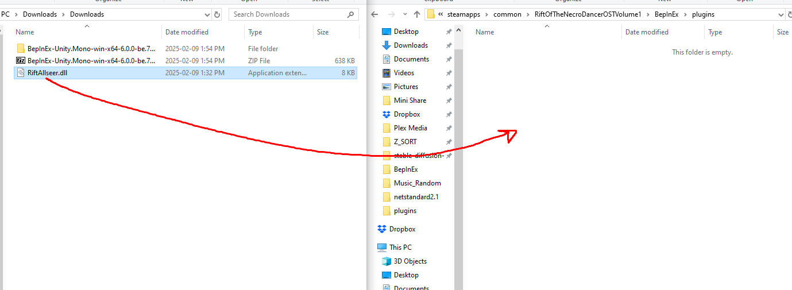
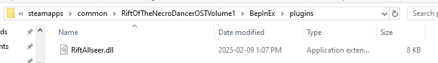
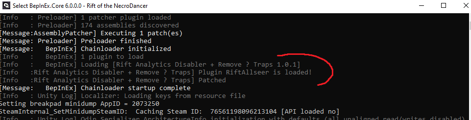

# Install BepInEx

This assumes you are running Windows 10, 64-bit

1. Navigate to the Rift of the Necrodancer Steam Folder:

2. Back up this folder somewhere safe

3. Install BepInEx Mono

    a. download and unzip [BepInEx 6.0.0-be.733](https://builds.bepinex.dev/projects/bepinex_be/733/BepInEx-Unity.Mono-win-x64-6.0.0-be.733%2B995f049.zip)

    

    b. Copy the contents into your Rift of the NecroDancer steam directory
    

4. Install this mod by copying `RiftAllseer.dll` to the plugins directory

5. Launch rift of the necrodancer

6. You should have a console window with info, meaning the mod has been launched successfully:

# Configuration

After the mod is launched for the first time, there is a file in `BepInEx1 > config > RiftAllseer.cfg`

In there you can change these configs:

- enable/disable game analytics (disabled by default)
- enable/disable logging game analytics to console (disabled by default)
- enable/disable ? traps (disabled by default)

> YOU MUST RESTART THE GAME FOR CONFIGURATION CHANGES TO TAKE EFFECT! 

# More details on installing BepInEx:

- docs: https://docs.bepinex.dev/master/articles/user_guide/installation/unity_mono.html

- builds: https://builds.bepinex.dev/projects/bepinex_be